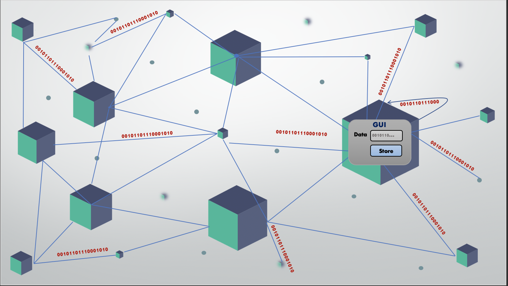

# sdm-jade
Sparse Distributed Memory implemented with JADE Agent Development Framework

## Overall Scenario
This distributed storage backs up and restores chunks of X bits of data, where X is a configurable parameter, which can take any values. The implementation is tested on X equal 1000 bit, 10000 bits, 100000 bits. The size of data chunks is configured during system initialization and remains unchanged during the system’s lifetime. It can be assumed as the fixed length of the packet in your system.

 

Architecturally the storage system is a hybrid peer-to-peer network with peer nodes(PeerNode) that preform the actual task of storage and reconstruction of data and the infrastructure nodes implementing helper functions(HelperNode).

The software architecture is designed to support a potentially large number of peers P (P is in the order of 10^6 – one million – nodes being active simultaneously).
The data to be stored is randomly generated sequences of X bits chunks. The system is tested on storing 10, 000 chunks of Data. The Data can enter the system from any peer node. Each peer will have a capacity of storing up to N chunks.

The entire peer-to-peer system maintains a pool of addresses for storage locations. The number of storage locations across the system is large (more than 106). This global number of storage locations (denoted as S=PN) is a configurable parameter via P and N.

Each storage location is X bins in size and is addressed by an X bits address, where X is the size of the data chunk. The addresses are X-bit binary sequences, which are RANDOMLY generated during the peer’s initialization time and remain stable during the peer’s lifetime, i.e. each peer has an NxX matrix for addressing purposes. Note that at the initialization time all storage locations are empty.

The Data will be stored based on the principles of proximity/similarity between the Data chunk and the address. The proximity metric is Hamming distance (the number of bit positions in which two sequences disagree). The threshold T (in number of different bits) is a configurable parameter of the system.

